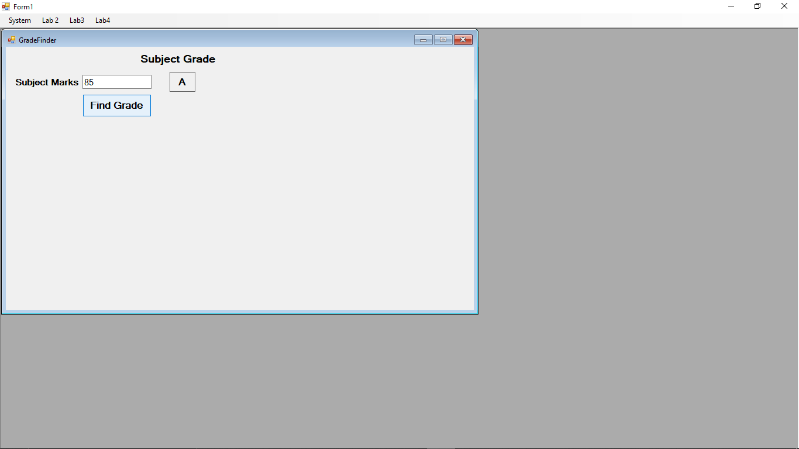
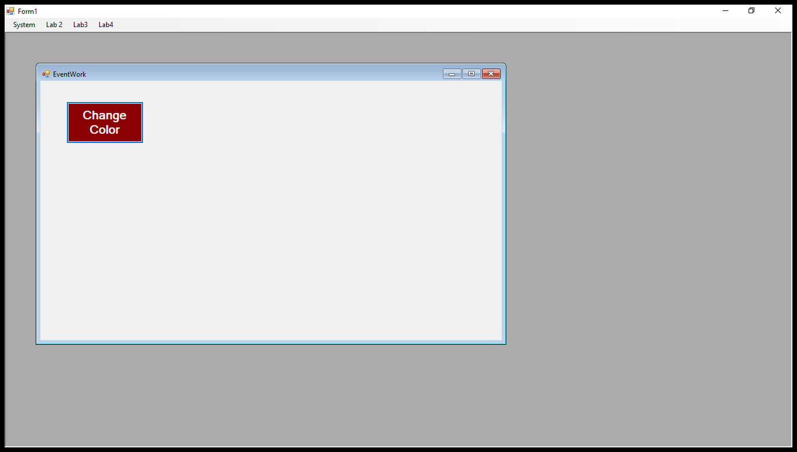
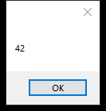
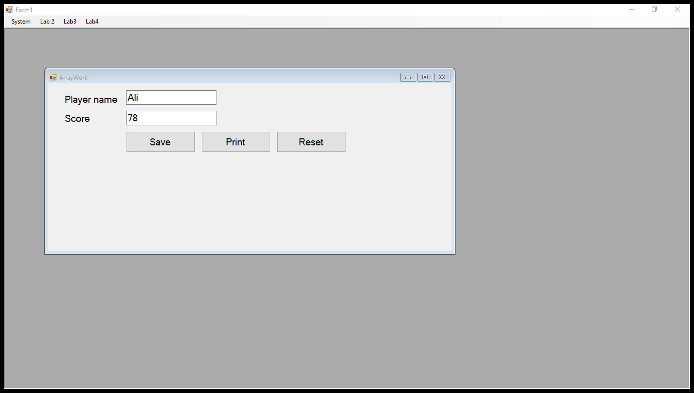
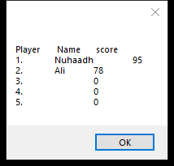
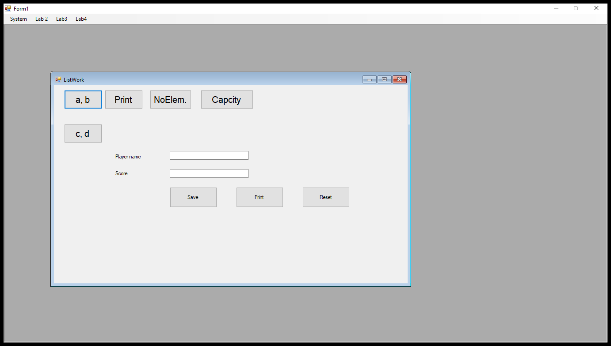
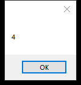
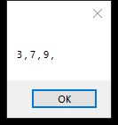

# ClassWork — C# WinForms Practice

A small Windows Forms (WinForms) project built while learning core C# concepts: methods, arrays, `List<T>`, events, and simple control flow. It's an MDI (Multiple Document Interface) app — one main window (`Form1`) opens each exercise as a child window from a menu, so all the practice lives in one place instead of separate projects.

This is practice/learning code, not a production app — kept as-is (including a couple of leftover typos in message text) so it's an honest record of the exercises as they were done.

## Tech stack

- C# / .NET Framework 4.7.2
- Windows Forms (`System.Windows.Forms`)
- Built with Visual Studio / JetBrains Rider

## How to run

Open `ClassWork.sln` in Visual Studio or Rider on Windows and run it (WinForms apps only run on Windows — there's no cross-platform display layer here). `Form1` opens as the main window with a menu to launch each exercise below as an MDI child window.

## Project structure

```
ClassWork/
├── ClassWork.sln
└── ClassWork/
    ├── Program.cs          # Entry point — starts the app on Form1
    ├── Form1.cs             # Main MDI parent window with the menu
    ├── ArrayWork.cs         # Arrays exercise
    ├── EventWork.cs         # Mouse events exercise
    ├── GradeFinder.cs       # If/else + exception handling exercise
    ├── ListWork.cs          # List<T> exercise
    └── MethodWork.cs        # Methods & method chaining exercise
```

Each `.cs` file has a matching `.Designer.cs` (auto-generated layout/control code from the WinForms designer) and `.resx` (resource file for that form) — those are standard WinForms scaffolding, not hand-written.

## The exercises

### `Program.cs` — Entry point
The standard WinForms bootstrap: `Application.Run(new Form1())` starts the message loop and shows the main window. `[STAThread]` is required because WinForms/COM components (like the clipboard and OLE drag-drop) need a single-threaded apartment.

### `Form1.cs` — Main menu (MDI parent)
Holds a menu strip with one item per exercise. Each click handler just creates the relevant form, sets `MdiParent = this`, and calls `.Show()`. This is the standard WinForms pattern for a "hub" window that launches child windows — it's why all five exercises can live in one running app instead of five separate `.exe`s.

### `ArrayWork.cs` — Arrays
Two parallel fixed-size arrays (`int[] score`, `string[] names`) with a shared `index` cursor.
- **Save** writes into the current index and advances it, and blocks once the array is full — practicing that arrays have a fixed length, unlike lists.
- **Print** loops over the array with a `for` loop, building a formatted string, and shows it in a `MessageBox`.
- **Reset** just zeroes the index (doesn't clear the data) — a simple way to reuse the array without reallocating it.

This exercise is about the basics of fixed-size arrays: declaring them with a length, indexing into them, and the bounds problem you don't have with `List<T>`.

### `EventWork.cs` — Mouse events
Two handlers, `button1_MouseHover` and `button1_MouseLeave`, swap the button's background color. It's a minimal example of wiring up event handlers beyond the default `Click` — showing that any control exposes multiple events (hover, leave, etc.) you can react to independently.

### `GradeFinder.cs` — Conditionals + exception handling
Takes a mark (0–100) and maps it to a letter grade using cascading `if / else if`:
- `>= 70` → A, `>= 60` → B, `>= 50` → C, `>= 40` → S, else F.

The input is wrapped in a `try/catch`: `Convert.ToInt32` throws if the text isn't a valid number, so the `catch` block shows an error message, clears the textbox, and refocuses it. This exercise pairs branching logic with defensive input handling — a non-numeric or out-of-range entry doesn't crash the app.

### `ListWork.cs` — `List<T>`
Demonstrates the common `List<int>` operations side-by-side with arrays:
- `AddRange` to bulk-insert values, and `Add` (commented out) as the single-item equivalent.
- `Capacity` vs `Count` — capacity is the internal backing-array size (grows in chunks), count is the actual number of items. Printing both shows that a list's capacity can be larger than what it currently holds.
- `Insert(index, value)` to place an item at a specific position.
- `Remove(value)` to delete the first matching item, and `RemoveAll(predicate)` to delete every match by a lambda condition.
- A small `PrintList` helper method turns the list into a readable string for the `MessageBox` calls.

This is the direct contrast to `ArrayWork.cs`: same idea (storing a sequence of numbers) but with a resizable collection and its richer API.

Side note: the designer for this form also has a `txtName`/`txtScore`/`btnSave`/`btnPrint`/`btnReset` group (visible at the bottom of the window) left over with no click handlers wired up — harmless leftover from early iteration, kept as-is rather than cleaned up after the fact.

### `MethodWork.cs` — Methods & composition
A single private `Add(decimal, decimal)` method reused across multiple buttons:
- `btnAdd2` calls it once for two numbers.
- `btnAdd3` nests calls — `Add(Add(num1, num2), num3)` — to sum three numbers by composing the two-argument method.
- `btnAdd4` nests it twice more for four numbers, showing how far you can push composition before it gets hard to read (that nested call is intentionally left dense as an example of *why* you'd normally break this into a loop or a `params decimal[]` method instead).
- `Average(decimal, decimal)` reuses `Add` and divides by 2, showing one method calling another.

The point of this exercise is method reuse: writing `Add` once and building more complex behavior (three-number sum, four-number sum, average) on top of it rather than repeating the `+` logic everywhere.

## Screenshots

All screenshots below are from the app actually running (built and launched via Visual Studio), not mockups.

**Grade Finder** — entering `85` and clicking Find Grade:



**Event Work** — the button after a mouse hover (`MouseHover` swapped its color to dark red):



**Methods** — `Add(15, 27)` computed through the shared `Add` method:



**Array Work** — two players saved into the fixed-size arrays:



`Print` reading back the full (fixed-size) array, including the still-empty slots:



**List Work** — the form, `Capacity` after adding three items, and `Print` showing the list contents:





## Notes

Since this targets .NET Framework 4.7.2 WinForms, it only builds and runs on Windows.
